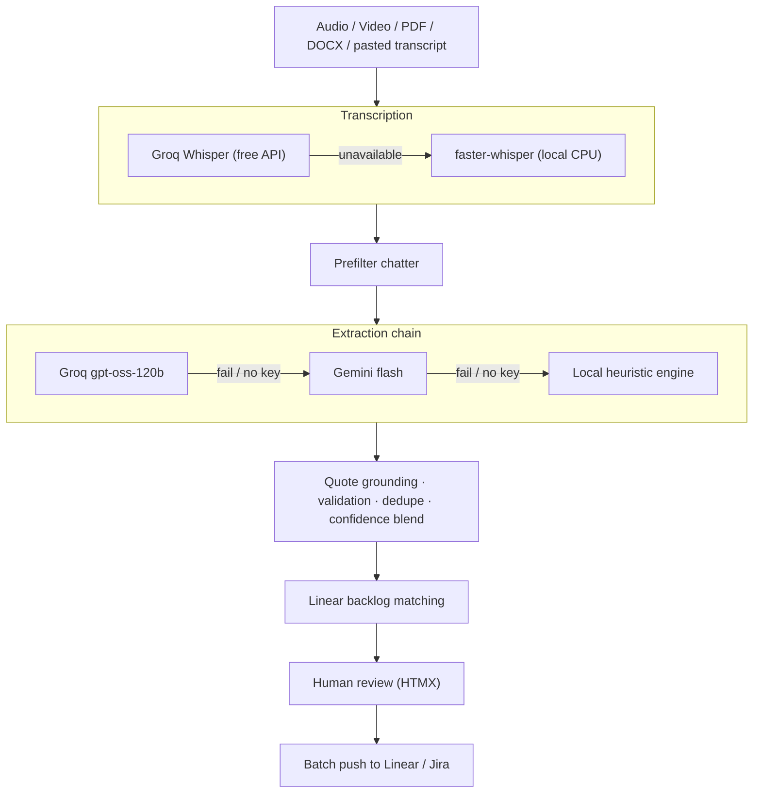

# Triage

Turn any meeting (a recording, a document, or a pasted transcript) into a clean, reviewed, deduplicated backlog in Linear or Jira.

AI proposes action items with confidence scores and source quotes. You review, edit, and approve. Nothing reaches your tracker without you.

**Built entirely on free and open-source tools.** No paid API required at any step.

## Features

- **Any input**: drag & drop audio (`.mp3`, `.wav`, `.m4a`, …), video (`.mp4`, `.mov`, `.webm`, …), documents (`.pdf`, `.docx`, `.txt`), or paste a raw transcript
- **Resilient AI chain**: Groq (primary) → Gemini (fallback) → built-in local heuristic engine; extraction never fully stops working
- **Free transcription**: Groq Whisper API when available, offline `faster-whisper` on CPU otherwise (no ffmpeg needed)
- **Grounded extraction**: every ticket cites the exact transcript sentence it came from; unverifiable quotes are flagged
- **Confidence scoring**: LLM confidence blended with grounding, validation, and assignee signals
- **Backlog continuity**: new items are matched against open Linear issues: create, update, link duplicate, or skip
- **Two-gate approval**: per-ticket approve, then a batch push with a visible plan
- **Live pipeline feedback**: transcribe → extract → match stages stream to the review page

## Quick start

```bash
git clone <this repo>
cd Meeting_to_tickets
cp .env.example .env
```

Edit `.env` and set:

| Key | Where to get it |
|-----|-----------------|
| `GROQ_API_KEY` | Free, no card: [console.groq.com/keys](https://console.groq.com/keys) |
| `GEMINI_API_KEY` (optional fallback) | Free: [aistudio.google.com/apikey](https://aistudio.google.com/apikey) |
| `CREDENTIALS_ENCRYPTION_KEY` | `python -c "from cryptography.fernet import Fernet; print(Fernet.generate_key().decode())"` |
| `DJANGO_SECRET_KEY` | any random string |

With no AI key at all, the app still works using the built-in heuristic extractor and local Whisper.

Then install and run (SQLite + eager tasks, no Docker needed):

```bash
cd backend
python -m venv .venv
.venv\Scripts\activate        # Windows  (source .venv/bin/activate on macOS/Linux)
pip install -r requirements.txt
python manage.py migrate
python manage.py runserver
```

Open http://127.0.0.1:8000, sign up, then drop in a meeting. To push tickets, add your Linear API key under **Settings**.

> First offline transcription downloads the `faster-whisper` model (~460MB for `small`) once. Set `FASTER_WHISPER_MODEL=tiny` in `.env` for a lighter download.

### Try it with zero setup

On **New meeting**, click a sample transcript. It runs the full review flow through the local engine, no API key or upload required.

## How it works



**Stack:** Django 5 + HTMX (no build step), Celery + Redis (or eager mode for local dev), Groq / Gemini / faster-whisper for AI, Linear GraphQL + Jira REST pushers, WhiteNoise static serving.

## Extraction quality eval

Golden-fixture eval harness with precision/recall/grounding metrics:

```bash
cd backend
python manage.py run_extraction_eval             # local heuristic (CI-friendly, no key)
python manage.py run_extraction_eval --use-llm   # live Groq/Gemini eval
```

Fixtures live in `backend/evals/fixtures/golden.yaml`, transcripts in `samples/`.

## Deployment

For a portfolio demo, deploy to [Railway](https://railway.app) or [Render](https://render.com):

1. Web service: `gunicorn config.wsgi` from `backend/`
2. Worker: `celery -A config worker` (or set `CELERY_TASK_ALWAYS_EAGER=True` to skip the worker)
3. Add Postgres + Redis add-ons
4. Set env vars from `.env.example`

## Linear setup

1. Linear → Settings → API → Personal API keys → create a key (`lin_api_...`)
2. In-app **Settings**: paste the key, click **Test connection**, pick a team
3. Approved tickets with backlog matches update existing issues instead of creating duplicates
